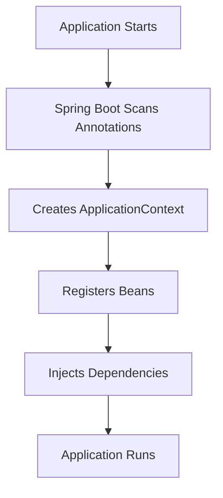

# Dependency Injection & Inversion of Control

Spring vs. Symfony (how it really works)

## 1. Inversion of Control (IoC)

Your code does not create its dependencies. The framework creates and provides them.

Spring is just an IoC container.

Dependency Injection (DI) is the mechanism used to implement IoC.

How it works:


## 2. Why

Without DI:

```kotlin
class UserService {
    private val repo = JdbcUserRepository() // tightly coupled
}
```

Problems:

1. Hard to test
2. Hard to replace implementation
3. Business logic now contains infrastructure code (abstraction leaks)

With DI (so called constructor injection):

```kotlin
class UserService(private val repo: JdbcUserRepository) {
}
```

## 3. DI in Spring

Spring has ApplicationContext and a collection of beans (Bean - Spring-managed object):

```kotlin
@Bean
fun repo(): JdbcUserRepository {
    // implementation
}
```

Spring:

```
1. Scan classpath
2. Detect beans
3. Build dependency graph
4. Instantiate beans
5. Inject dependencies
6. Manage lifecycle
```

There are different annotations what are instantiated by Spring: Bean, Repository, RestController, Service,
Component ...

### Bean lifecycle


The flow:

1. Spring loads beans definition: `@Configuration`, `@Bean` and other stereotypes (`@Component`, `@Service`,
   `@Repository`)
2. Instantiation of beans (loading them into the Context aka Container): via constructor injections primarily (usually
   happens once, bean is a singleton by default; to change, foes example, `@Scope("prototype")`)
3. Dependency injection: via constructor or using annotations `@Autowired`, `@Inject`, `@Value` ... (or field
   injections)
4. BeanPostProcessor before init: all registered BeanPostProcessors are invoked (
   `postProcessBeforeInitialization(bean)`; AOP magic
   happens here, enabling of Proxies (`@Transactional`, `@Async`, `@Cacheable`))
5. `@PostConstruct` fun init() execution
6. BeanPostProcessor after init: `postProcessAfterInitialization(bean)`
7. ...

## 4. Declaring beans in Spring

```kotlin
@Repository
class UserRepository

@Service
class UserService(private val users: UserRepository)
```

How:

1. Spring scans the classpath
2. Finds `@Repository` and `@Service`
3. Registers them as beans
4. Injects

## 5. How Spring resolves dependencies

Spring uses type-based resolution

```kotlin
@Service
class EmailService(private val mailSender: MailSender)
```

Spring:

1. looks for a bean of type MailSender
2. if exactly one exists => inject
3. if multiple => fail unless qualified

```kotlin
@Component
@Qualifier("smtp")
class SmtpMailSender : MailSender

@Component
@Qualifier("mock")
class MockMailSender : MailSender

class EmailService(
    @Qualifier("smtp") private val sender: MailSender
)
```

## 6. What else

Spring DI is not just wiring:

1. transaction proxies (@Transactional)
2. AOP

Spring wraps the bean in a proxy:

```kotlin
@Transactional
fun renameUser(...) {
}
```

## 7. Autowiring in Symfony - the same idea

```php
final class UserService {
    public function __construct(
        private UserRepository $users
    ) {}
}
```

Similar to Spring constructor injection.

Difference in transaction handling:

Spring has `@Transactional` annotation, Symfony favors explicit infrastructure calls:

```php
$entityManager->beginTransaction();
try {
    ...
    $entityManager->commit();
} catch (...) {
    $entityManager->rollback();
}
```

## 8. Testing

Test isolation with DI.

```kotlin
@SpringBootTest
class UserServiceTest {
    @Autowired
    lateinit var service: UserService

    @MockBean
    lateinit var repo: UserRepository
}

@BeforeEach
fun setUp() {
    every { repo.findUserById(any()) } returns User(name = "Test")
}
```

Bean is mocked and injected during test suite execution.

## Sources

https://www.marcobehler.com/guides/spring-framework#_springs_aspect_oriented_programming_aop \
https://dev.to/wittedtech-by-harshit/the-magic-of-spring-boots-inversion-of-control-ioc-361j \
https://www.baeldung.com/inversion-control-and-dependency-injection-in-spring
